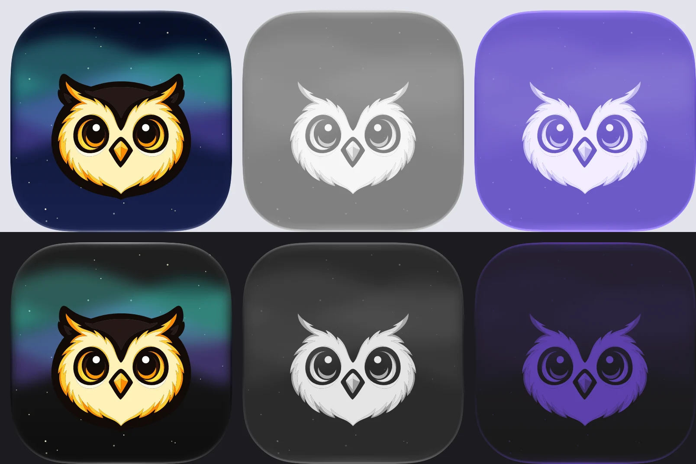
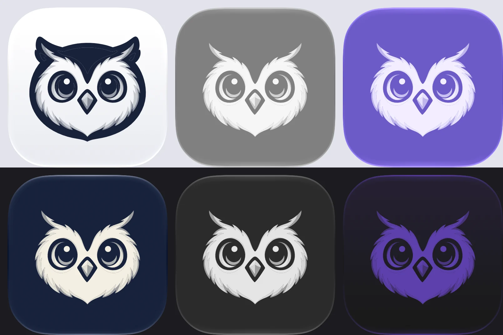
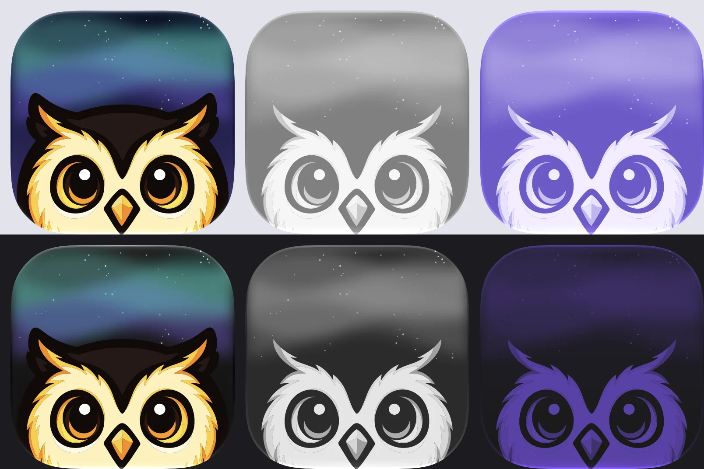
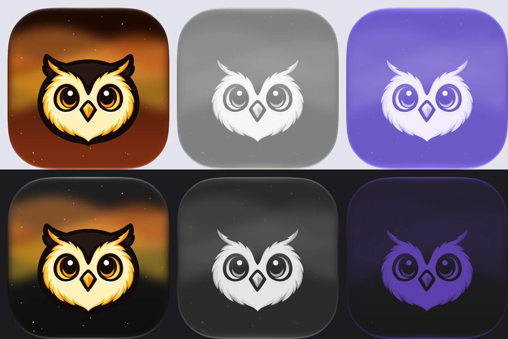
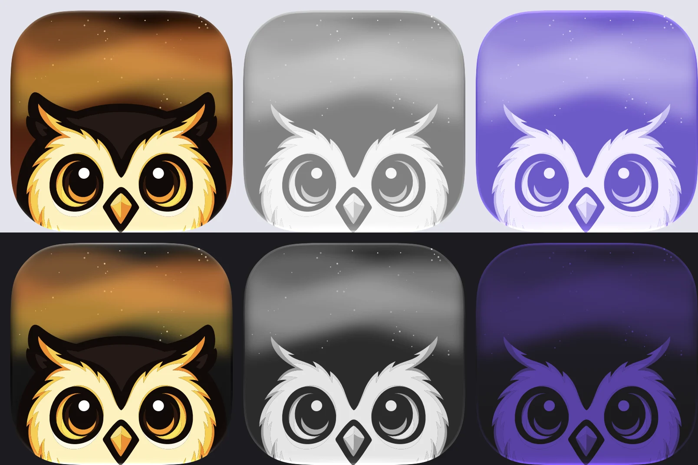
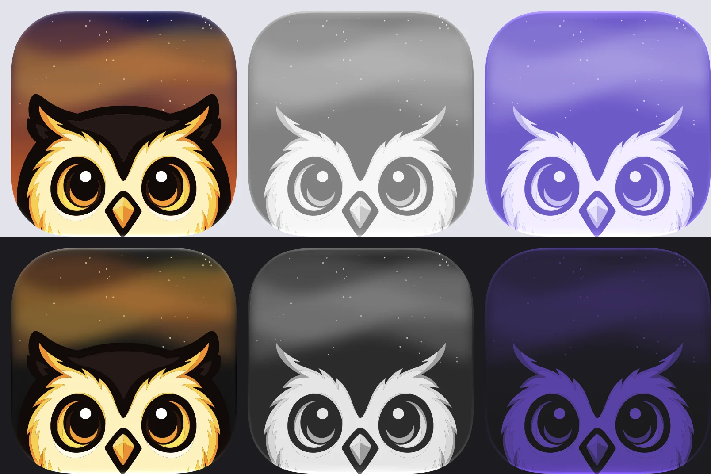

# App icon candidates

Candidates for Torchsnap's app icon, made from the Snappy emblem
(`assets/snappy-emblem-feathered.svg`). `aurora-rise` is the app icon
(ADR 60), named by `app_icon` in `just/assets.just`; the others are
kept as options.

| Candidate | Default · ClearLight · TintedLight (top), Dark · ClearDark · TintedDark (bottom) |
|---|---|
| `aurora`: the colour owl under teal and violet aurora ribbons on a night sky with stars |  |
| `ink`: the owl in one navy ink on white; in dark appearance its negative, pale ink on navy |  |
| `aurora-rise`, **the app icon**: the colour owl rising over the bottom edge under the aurora |  |
| `aurora-ember`: `aurora` on a warm night, deep brown to rust, with orange and gold ribbons |  |
| `aurora-rise-ember`: `aurora-rise` on that warm night |  |
| `aurora-rise-dusk`: `aurora-rise` from indigo to the accent orange at the horizon, with gold and orange ribbons |  |

The warm skies use Torchsnap's accent oranges (`#f97316`, `#fb923c`,
`#ea580c`) and the emblem's gold (`#fdcc33`).

In clear and tinted appearance every candidate shows the negative owl.
There the `aurora` layouts dim their sky to 35 %; the `aurora-rise`
layouts keep their sky as in the other appearances.

The previews are Apple's own renders: `ictool`, the renderer inside
Xcode's Icon Composer, draws every macOS 26 appearance of each
candidate.

## Files

| Path | What |
|---|---|
| `snappy-emblem-flat.svg` | The emblem flattened: one path per colour, none overlapping (`tools/flatten-emblem`). The source of every owl here. |
| `<candidate>/<candidate>.svg` | The whole icon as one square SVG, full bleed, without the macOS tile shape. |
| `<candidate>/sky.svg` | The sky (stars and aurora ribbons) of the aurora candidates, the source of their sky layer. |
| `<candidate>/<candidate>.icon/` | The Icon Composer document: `icon.json` (background fill, layer groups, per-appearance overrides) and `Assets/` with the owl layer SVGs and the sky layer PNG. |
| `previews/<candidate>.webp` | The six `ictool` renders shown above. |
| `compiled/` | The app icon compiled for the bundle (`just app-icon-compile`): `Assets.car` and `AppIcon.icns` from `actool`, `app-icon-1024.png` the Default render. |

Everything here is generated. Change the tools, not the files: a
rebuild overwrites them, and edits made in Icon Composer as well.

## Rebuilding

```
just app-icon-candidates
```

It runs `tools/flatten-emblem` (the emblem to `snappy-emblem-flat.svg`)
and then `tools/build-app-icons` (all other files). Requirements:

- `uv`, which installs the flattening tool's Python packages
  (skia-pathops, fonttools) on the fly;
- `rsvg-convert` from librsvg (`brew install librsvg`) for the sky
  layer PNGs;
- Xcode with Icon Composer for `ictool`, found at
  `/Applications/Xcode.app/Contents/Applications/Icon Composer.app/Contents/Executables/ictool`;
  the `ICTOOL` environment variable points the build at another copy.
  The `ictool` on the PATH (`Xcode.app/Contents/Developer/usr/bin`)
  does not know `--export-image`;
- ImageMagick (`magick`) to put the previews together.

`tools/build-app-icons --no-raster` writes only the vector files and
`icon.json`, without the last three.

After a change to the app icon's candidate, or to `app_icon`:

```
just app-icon-compile
```

It needs `xcrun actool` (Xcode), Icon Composer's `ictool`, ImageMagick
and `oxipng`, and rewrites `compiled/`; commit it. `just
asset-app-icons` then builds `src-tauri/icons/` from `compiled/` without
Xcode, as on CI.

Tests: `just test-tools` covers `tools/build-app-icons` with the
standard library alone and skips the flattening tests;
`just test-tools-all` runs them all.

## How the icons are put together

- **The owl** is the flattened emblem. In the colour candidates every
  path keeps its colour. The one-ink owl gives every colour the navy ink
  at an opacity from its luminance L: `(1 - L - 0.06) / 0.7`, so the
  head prints solid and the cream face as paper. The negative uses pale
  ink at `(L - 0.2) / 0.65`. Without the flattening, overlapping shapes
  would add their opacities up.
- **The sky** is SVG: stars as circles from a seeded random sequence,
  the aurora as wavy bands softened with a Gaussian blur filter.
- **Coordinates.** The designs were sketched on Apple's 824 px icon tile
  inside a 1024 px canvas. Icon Composer's canvas is the tile itself at
  1024 px, so the tools scale sketch coordinates by 1024 / 824.
- **Layers.** The owl is the top layer group, the sky the group below
  it, and the background a gradient fill in `icon.json`. The owl is not
  Liquid Glass (`"glass": false`).

What Icon Composer does differently from a browser, found while
building these:

- `ictool` ignores SVG filters. The sky layer is therefore a PNG that
  `rsvg-convert` renders from `sky.svg`, with the blur applied.
- A layer names its image either once (`image-name`) or per appearance
  (`image-name-specializations`: `[{"value": …}, {"appearance": "dark",
  "value": …}, {"appearance": "tinted", "value": …}]`). With both,
  Icon Composer uses the plain name. The background is likewise either
  `fill` or `fill-specializations`.
- The `tinted` appearance covers both the clear and the tinted
  renditions. Both draw the picture from brightness: the navy one-ink
  owl vanished there, and the colour owl's dark head became a grey
  shadow. The negative owl reads in both.
- In clear and tinted the system draws the plate (grey glass, or the
  user's tint colour) and the lighting; the icon controls what lies on
  it. A layer can be dimmed (`opacity-specializations`) or hidden
  (`hidden-specializations`) for the `tinted` appearance alone. Group
  translucency, the owl layer's opacity and the group shadow changed
  nothing in the clear render.

## Decisions so far

From the maintainer, 2026-10-01:

- `aurora-rise` is the app icon for now; the other candidates stay as
  options (`aurora-ember`, `aurora-rise-ember` and `aurora-rise-dusk`
  from the round in Torchsnap's own oranges).
- Clear and tinted: the negative owl in every candidate; the `aurora`
  sky faint, the `aurora-rise` sky shown.
- The owl layer stays flat (no Liquid Glass).
- The same art at every size; no simplified small sizes.
- The DMG's volume icon is the app icon.
- The app icon ships through `actool` (next section).

## Shipping a `.icon` with Tauri

Tauri 2 has no support for `.icon` documents yet (feature request
[tauri#14207](https://github.com/tauri-apps/tauri/issues/14207)); with
one in `bundle.icon`, bundling fails in `actool`
([tauri#15315](https://github.com/tauri-apps/tauri/issues/15315)).
Torchsnap compiles the document itself (ADR 60):

1. `just app-icon-compile` runs `actool` on the `app_icon` candidate
   (as `AppIcon.icon`, with `--app-icon AppIcon`, target `mac`, the
   bundle's minimum system version 10.13) and writes `Assets.car` and
   `AppIcon.icns` to `compiled/`, plus the Default render.
2. `just asset-app-icons` feeds the render to `tauri icon` for every
   platform, then puts `AppIcon.icns` in place of Tauri's
   `src-tauri/icons/icon.icns` and copies `Assets.car` next to it.
3. `bundle.resources` in `tauri.conf.json` copies `Assets.car` into
   `Contents/Resources/`; `src-tauri/Info.plist` adds
   `CFBundleIconName` = `AppIcon`. The bundler sets `CFBundleIconFile`
   to `icon.icns` itself.

Checked on a debug bundle built this way (2026-10-01):
`just verify-bundle` finds both keys, `Assets.car` and `icon.icns`;
macOS draws the bundle's icon as the `aurora-rise` render; and the DMG's
`.VolumeIcon.icns` is the same file as `icon.icns`. Earlier, on a stub
bundle whose `Assets.car` held `ink` and whose `.icns` held `aurora`,
macOS showed `ink`: with `CFBundleIconName` set, it takes `Assets.car`.
Not checked: the dark, clear and tinted icon styles on a real system,
which follow a system-wide setting.
